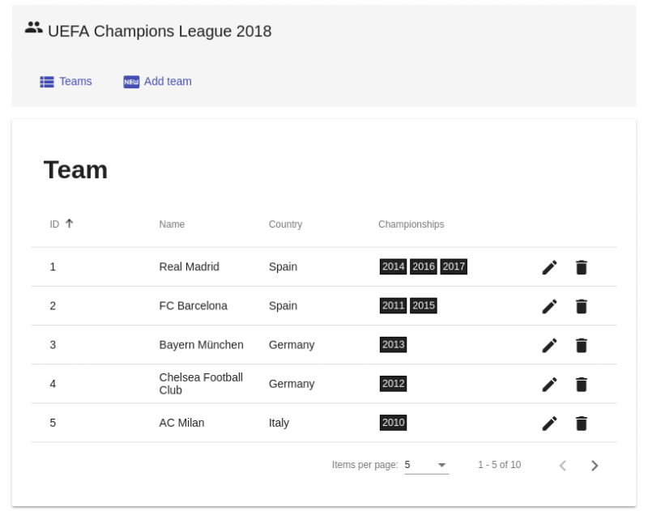
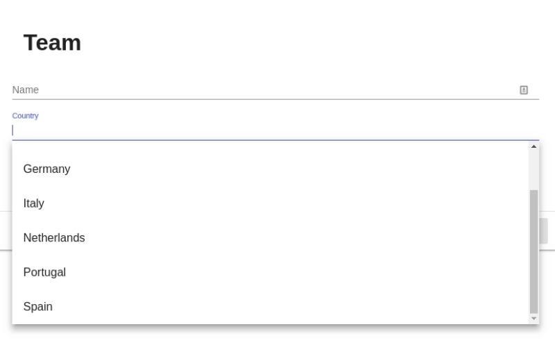
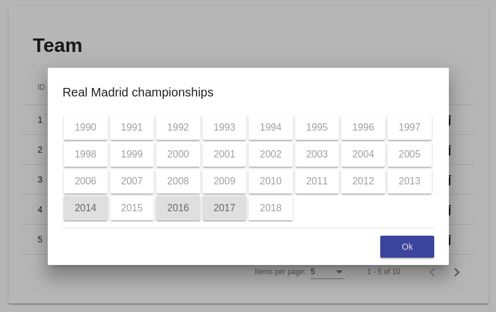
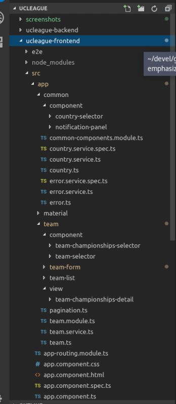
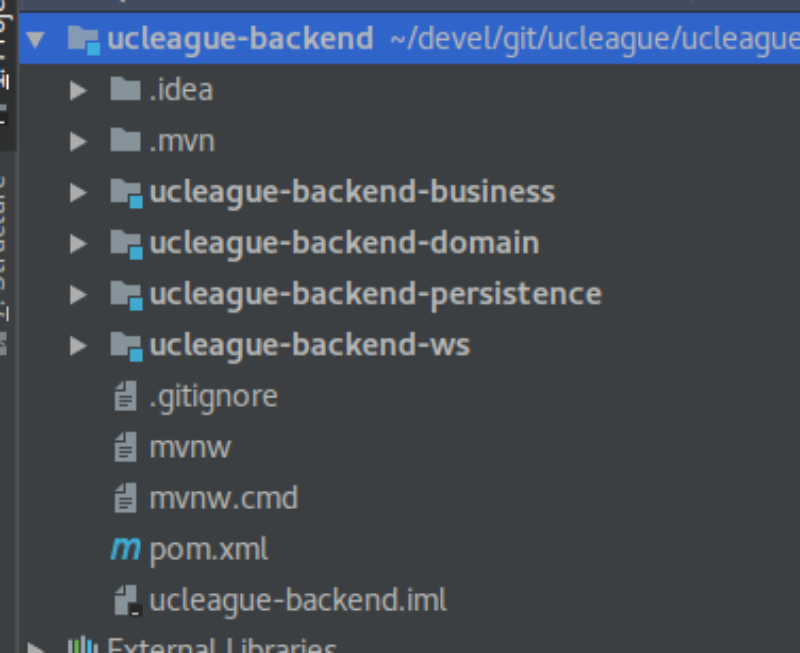

# UEFA Champions League 2018

Application (proof of concept) to manage teams.







## Fronted application

Main features:

* Angular 5 application with Typescript.
* Angular CLI.
* Material design components.
* Server side pagination.
* Custom component for select countries and teams with autocomplete via backend.
* Reactive forms.

### Project structure



### Launch

```
cd ucleague-frontend

# Install dependencies
npm install

# Lauch application
npm start
```

Open this URL in the browser:

http://localhost:4200/


## Backend application

Main features:

* Spring Boot microservice.
* RESTful API.
* Spring Data JPA.
* Embedded H2 database.
* Dozer for bean mapping.

### Project structure




### Launch

```
cd ucleague-backend

# build
mvn clean install

# Lauch application
cd ucleague-backend-ws
mvn spring-boot:run
```
